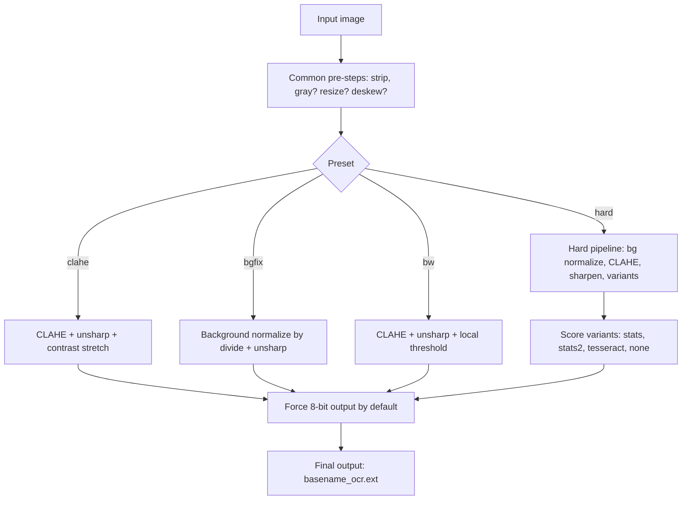
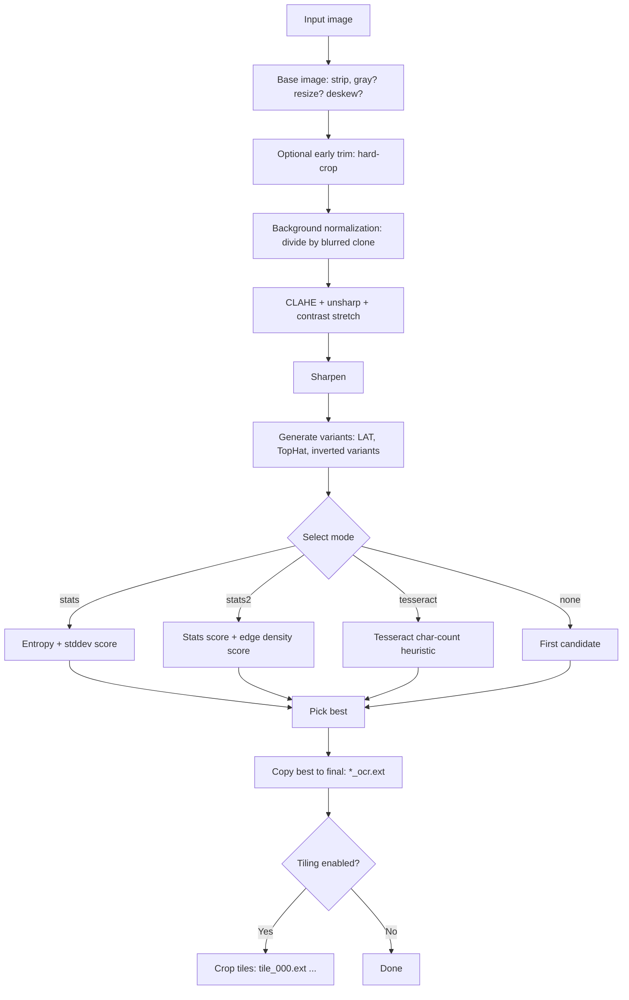

# OCR Preprocess Toolkit

### Easy Image Enhancement Pipeline for Difficult Historical Documents

**Author:** Kimiya Kitani
------------------------------------------------------------------------

## Abstract

This repository provides a reproducible, research-oriented image
preprocessing pipeline designed to improve Optical Character Recognition
(OCR) performance on difficult historical materials (e.g., faint
rubbings, low-contrast inscriptions, and unevenly illuminated archival
documents).

I believe that the toolkit is implemented as a Bash script powered by **ImageMagick**
and optionally integrates **Tesseract OCR** for scoring-based variant
selection in the most difficult cases. The pipeline is deterministic,
parameterized, and suitable for publication-grade workflows where
reproducibility matters.

------------------------------------------------------------------------

## 1. System Architecture

### 1.1 Overall Processing Flow



### 1.2 Hard Mode Detailed Flow



------------------------------------------------------------------------

## 2. Presets (Design Rationale)

  -------------------------------------------------------------------------
  Preset           Purpose             Typical use case
  ---------------- ------------------- ------------------------------------
  `clahe`          General enhancement Start here for most materials

  `bgfix`          Uneven background   Shadows, uneven illumination
                   removal             

  `bw`             Binarization-like   When OCR prefers stronger separation
                   output              

  `hard`           Severe degradation  Very faint rubbings; generates
                                       variants and selects best
  -------------------------------------------------------------------------

**Note:** Some OCR engines (notably Google Vision) can fail on 1-bit
PNG. This toolkit therefore forces **8-bit grayscale output** by default
for PNG/JPG/TIF unless you disable it.

------------------------------------------------------------------------

## 3. What is Tesseract OCR?

Tesseract is an open-source OCR engine maintained by the community and
Google contributors. It supports many languages, but performance depends
heavily on image quality, layout, and available training data.

Official repository (recommended reference for installation/build
instructions):\
https://github.com/tesseract-ocr/tesseract

### How this toolkit uses Tesseract

This toolkit **does not require** Tesseract for preprocessing. Tesseract
is used **only when** you choose hard-mode selection:

-   `--select tesseract`

In that mode, the script runs Tesseract on each candidate variant and
selects the one that yields the largest **character count** (heuristic).
This does **not** guarantee correctness; it is intended as a pragmatic
selector for extremely faint materials.

------------------------------------------------------------------------

## 4. Installation Requirements

-   Bash (Linux / macOS / WSL)
-   ImageMagick 7+ (`magick` command)
-   Optional: Tesseract OCR (only if using `--select tesseract`)

Quick checks:

``` bash
magick -version
tesseract --version
```

------------------------------------------------------------------------

## 5. Usage

### 5.1 Basic

``` bash
./ocr_preprocess.sh -p clahe input.jpg
```

Output defaults to: `input_ocr.png` (format default: `png`).

### 5.2 Recommended starting points

``` bash
# 1) Try clahe first
./ocr_preprocess.sh -p clahe -w 1600 input.jpg

# 2) If background is uneven
./ocr_preprocess.sh -p bgfix -b 40 -w 2000 input.jpg

# 3) If you want stronger separation (binarize-ish)
./ocr_preprocess.sh -p bw -A "35x35+10%" -w 2000 input.jpg

# 4) If OCR returns 0 chars, try hard mode
./ocr_preprocess.sh -p hard --select stats2 -w 2000 input.jpg
```

------------------------------------------------------------------------

## 6. CLI Reference (All Options)

The following help text is generated by the script and should remain the
source of truth.

``` text
ocr_preprocess.sh - ImageMagick preprocessing for OCR

USAGE:
  ocr_preprocess.sh [options] input_image

OPTIONS:
  -p, --preset PRESET     Processing preset: clahe | bgfix | bw | hard (default: clahe)
  -o, --out PATH          Output file path (default: input_basename + _ocr.png)
                          NOTE: for preset 'hard', this is the final single output path.
  -O, --outdir DIR        Output directory (default: same as input)
  -f, --format EXT        Output format extension: png|jpg|tif (default: png)

  --gray                  Force grayscale (default: on)
  --no-gray               Disable grayscale conversion
  -w, --width PX          Resize to width PX (keeps aspect; default: no resize)

  --clahe ARG             CLAHE args (default: 25x25+128+3)
  --unsharp ARG           Unsharp args (default: 0x1.2+1.0+0.02)
  --stretch ARG           Contrast stretch (default: 0.2%x0.2%)

  -b, --blur RADIUS       (bgfix) background blur radius (default: 40)
  -A, --adaptive ARG      (bw) local threshold args used by -lat (default: 35x35+10%)

  # ----- hard preset options -----
  --hard-blur RADIUS      (hard) background blur radius for Divide (default: 30)
  --lat ARG               (hard) LAT args (default: 25x25-5%)
  --hard-crop             (hard) try trimming borders early (default: on)
  --no-hard-crop          (hard) disable early trim
  -T, --tile PX           (hard) tile size (e.g., 1024). 0 = no tiling (default: 0)

  --keep-variants         (hard) keep all generated variants (default: off)
  --select MODE           (hard) choose best variant by: stats|stats2|tesseract|none (default: stats)
  --tess-lang LANGS       (hard) tesseract languages (e.g., 'eng+jpn' or 'tha') (default: eng)
  --tess-psm N            (hard) tesseract PSM (default: 6)

  --tophat RADIUS         (hard) morphology TopHat disk radius (default: 15)
  --canny ARG             (hard) canny args for stats2 scoring (default: 0x1+10%+30%)

  --no-force-8bit         Do not force 8-bit output (default: force)
  -d, --deskew            Apply deskew 40%
  -t, --trim              Trim borders (single-output presets; for hard use --hard-crop instead)
  -n, --dry-run           Print command only (do not run)
  -q, --quiet             Less output
  -h, --help              Show help

NOTES:
  - Start with preset 'clahe'. If background uneven, try 'bgfix'.
  - For binarization, try 'bw' but Vision OCR sometimes prefers grayscale.
  - For very difficult rubbings where Vision returns 0 chars, use preset 'hard' and feed the single *_ocr output to OCR.
```

### 6.1 Option groups (summary)

#### Core I/O

-   `-p, --preset PRESET` : `clahe | bgfix | bw | hard`
-   `-o, --out PATH` : output file path (for `hard`, this is the final
    single output)
-   `-O, --outdir DIR` : output directory
-   `-f, --format EXT` : `png|jpg|tif`

#### Common processing toggles

-   `--gray` / `--no-gray` : enable/disable grayscale conversion
-   `-w, --width PX` : resize to width
-   `-d, --deskew` : deskew (40%)
-   `-t, --trim` : trim borders (single-output presets; for hard use
    `--hard-crop`)
-   `--no-force-8bit` : do not force 8-bit outputs (default is to force)

#### CLAHE / enhancement parameters

-   `--clahe ARG` : CLAHE args (default: `25x25+128+3`)
-   `--unsharp ARG` : unsharp args (default: `0x1.2+1.0+0.02`)
-   `--stretch ARG` : contrast stretch (default: `0.2%x0.2%`)

#### bgfix parameters

-   `-b, --blur RADIUS` : background blur radius (default: `40`)

#### bw parameters

-   `-A, --adaptive ARG` : local threshold args used by `-lat` (default:
    `35x35+10%`)

#### hard preset parameters

-   `--hard-blur RADIUS` : blur radius for divide (default: `30`)
-   `--lat ARG` : LAT args (default: `25x25-5%`)
-   `--hard-crop` / `--no-hard-crop` : enable/disable early trim
    (default: on)
-   `-T, --tile PX` : tile size (default: 0 = no tiling)
-   `--keep-variants` : keep all generated variants (default: off)
-   `--select MODE` : `stats | stats2 | tesseract | none`
-   `--tess-lang LANGS` : Tesseract languages (default: `eng`)
-   `--tess-psm N` : Tesseract PSM (default: `6`)
-   `--tophat RADIUS` : morphology TopHat disk radius (default: `15`)
-   `--canny ARG` : Canny args for stats2 scoring (default:
    `0x1+10%+30%`)

#### Misc

-   `-n, --dry-run` : print command only
-   `-q, --quiet` : less output
-   `-h, --help` : help

------------------------------------------------------------------------

## 7. Limitations

-   Preprocessing can improve OCR yield but cannot guarantee
    correctness.
-   Selection modes are heuristics; they optimize for "OCR-likeliness,"
    not semantic accuracy.
-   Extremely stylized scripts or heavily degraded materials may still
    require manual intervention or specialized OCR models.

------------------------------------------------------------------------

## 8. License

MIT License
